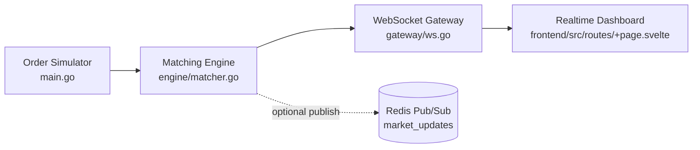
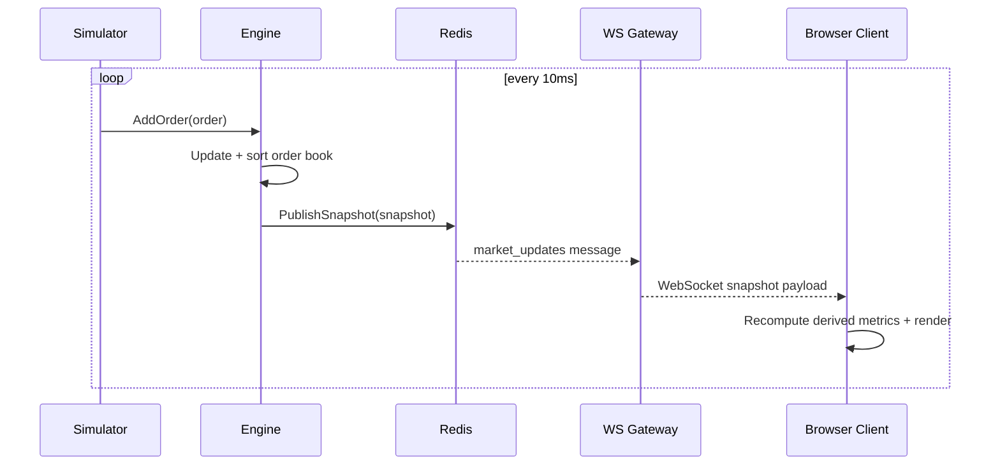

# Quantum Distributed Order Book

A realtime distributed order book simulation platform built with Go, WebSocket fan-out, and a live trading-style dashboard, with optional Redis snapshot publishing.

## Live Demo

- Production demo (GitHub Pages): https://mohammad77radwan.github.io/go-distributed-orderbook/

Note: the demo is deployed automatically by the `Deploy Demo (GitHub Pages)` workflow on every push to `main`. To get true realtime updates on Pages, set repository secret `PUBLIC_WS_URL` to your backend websocket endpoint (example: `wss://your-backend.example.com/ws`).

For a single-host realtime deployment (frontend + backend websocket together), deploy this repo as a Docker web service using [Dockerfile](Dockerfile) (for Render, [render.yaml](render.yaml) is included).

Render will inject `PORT`; the Go server binds to that value automatically.
If websocket delivery is blocked by a proxy, the frontend falls back to polling `/snapshot` on the same service so the UI still updates from live backend state.

## At A Glance

| Capability | Implementation |
|---|---|
| Matching + book maintenance | In-memory concurrent order book (`sync.RWMutex`) |
| Priority model | Price-time priority for bids/asks |
| Event transport | Direct engine -> websocket broadcast (optional Redis publish) |
| Client delivery | WebSocket hub with safe concurrent writes |
| UI | Svelte realtime dashboard with derived market metrics |
| Ops basics | Health endpoint, graceful shutdown, reconnect behavior |
| Quality gates | GitHub Actions test/check/build on push + PR |

## What The System Does

The system continuously simulates market order flow and streams snapshots of top-of-book state to connected browser clients. The frontend renders that stream as a trading cockpit: spread, mid price, liquidity by side, depth map, ladder view, and flow/tape-style reactions.

## Architecture

### Component Topology



### Runtime Interaction Sequence



## Core Technical Highlights

### Backend
- Concurrency-safe order book operations with lock granularity (`RWMutex`).
- Stable sorting for deterministic tie-breaking:
	- Bids sorted by descending price, then oldest first.
	- Asks sorted by ascending price, then oldest first.
- Snapshot capping (top 10 levels per side) to keep payloads bounded.
- Redis-backed event decoupling between engine and gateway.
- WebSocket hub model with per-client write mutexes for safe fan-out.
- Process lifecycle handling with cancellation and graceful server shutdown.

### Frontend
- Reactive WebSocket store for realtime state updates.
- Socket reconnect loop for resilience.
- Derived analytics from stream snapshots:
	- best bid / best ask
	- spread + mid price
	- side liquidity totals
	- imbalance
- Visual modules for depth, ladder, and tape semantics.

## Repository Layout

```text
.
├── engine/
│   ├── matcher.go      # Book mutation, sorting, snapshot generation
│   ├── pubsub.go       # Engine wrapper + Redis snapshot publisher
│   └── types.go        # Domain types
├── gateway/
│   └── ws.go           # Redis bridge + websocket client hub
├── frontend/
│   ├── src/lib/websocket.ts      # Realtime socket store
│   └── src/routes/+page.svelte   # Dashboard screen
├── main.go             # Wiring, simulator, HTTP server
└── docker-compose.yml  # Redis runtime
```

## Quick Start

### Prerequisites
- Go 1.21+
- Redis 7+
- Node.js 20+ (for frontend build/dev)

### 1) Start Redis

```bash
docker compose up -d redis
```

or:

```bash
redis-server --port 6379
```

### 2) Run backend

```bash
go run .
```

Backend listens on `:8080`.

### 3) Frontend development mode

```bash
cd frontend
npm install
npm run dev
```

### 4) Build frontend for static serving via backend

```bash
cd frontend
npm run build
cd ..
go run .
```

`main.go` serves static assets from `frontend/build` when present.

## API Surface

- `GET /healthz` -> readiness probe (`ok`)
- `GET /ws` -> websocket stream of `OrderBookSnapshot`

### Snapshot Payload

```json
{
	"bids": [
		{
			"id": "1712234567890",
			"type": "buy",
			"price": 100.12,
			"quantity": 540,
			"createdAt": "2026-04-03T10:20:30Z"
		}
	],
	"asks": [],
	"timestamp": "2026-04-03T10:20:30Z"
}
```

## Measurable Performance

Benchmarks were executed with:

```bash
go test ./engine -bench . -benchmem -run ^$
```

Environment:
- OS: Linux (container)
- CPU: Intel(R) Xeon(R) Platinum 8370C CPU @ 2.80GHz
- Go: 1.25.8

Results:

| Benchmark | ns/op | B/op | allocs/op |
|---|---:|---:|---:|
| `BenchmarkOrderBookAddOrderSingleThreaded` | 38506 | 77134 | 6 |
| `BenchmarkOrderBookAddOrderParallel` | 254042 | 368080 | 6 |
| `BenchmarkOrderBookSnapshotTop10` | 6187 | 32768 | 2 |

Interpretation:
- Snapshot generation is cheap and predictable (`~6.2us/op`, 2 allocs/op).
- Add-order path remains stable under contention with deterministic priority sorting.
- The simulation loop in `main.go` currently emits one order every `10ms` (about 100 updates/sec).

## Realtime Behavior And Recovery

The frontend socket client (`frontend/src/lib/websocket.ts`) is designed for deterministic recovery:

- Reconnect interval: 1000ms after socket close
- Render decoupling: UI publishes the latest snapshot on `requestAnimationFrame`
- Malformed payload handling: dropped without tearing down application state

Practical implication:
- transient websocket failures recover quickly (first retry within 1 second)
- rendering remains smooth under bursty update cadence

## Design Notes

### Why snapshots over diffs?
- Stateless client rendering model.
- Lower cognitive overhead for correctness.
- Easier recovery after reconnect.

### Why Redis in the middle?
- Clean separation between compute and delivery planes.
- Future-ready for multi-gateway fan-out.
- Operationally simple and familiar.

### Why in-memory book?
- Lowest-latency path for simulation workloads.
- Straightforward deterministic behavior.
- Easy extension to persisted event pipelines later.

## Reliability And Operations

- Graceful shutdown path using `signal.NotifyContext`.
- Read deadlines + pong handling in websocket read pump.
- Client cleanup on write/read failure.
- Frontend reconnect loop on socket close.

## CI / Quality Gates

GitHub Actions workflows:

- `.github/workflows/ci.yml`
	- Go dependency verification (`go mod tidy` must be clean)
	- Go unit tests
	- Go race detector
	- Frontend type/framework checks (`npm run check`)
	- Frontend production build (`npm run build`)

- `.github/workflows/deploy-pages.yml`
	- Deploys demo to GitHub Pages on push to `main`
	- Supports external websocket endpoint via `PUBLIC_WS_URL` repository secret

## Validation Commands

```bash
go test ./...
```

```bash
cd frontend && npm run check
```

```bash
go test ./engine -bench . -benchmem -run ^$
```

## Roadmap

- Add external order ingestion API (`REST`/`gRPC`).
- Add benchmark suite with p95/p99 publish-to-render latency.
- Add multi-symbol channels and partitioned routing.
- Add deterministic replay mode from persisted snapshots/events.
- Add observability metrics and tracing for end-to-end flow.

## License

This project is licensed under the MIT License. See [LICENSE](LICENSE).
